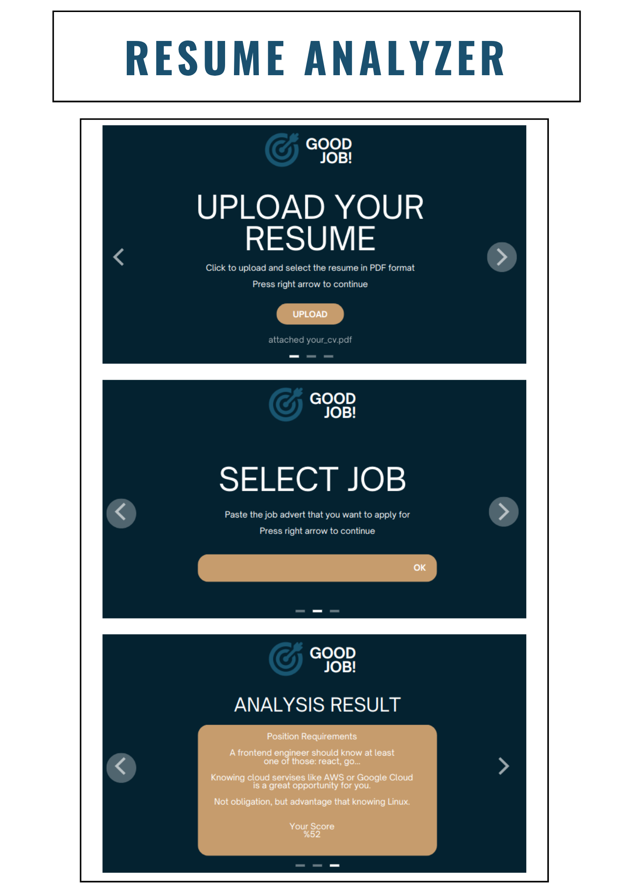
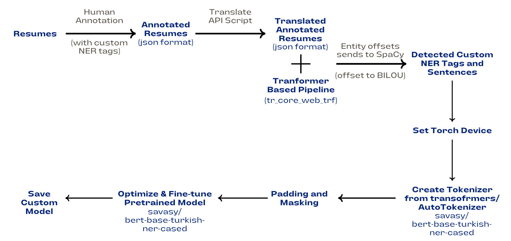

<div align="center">
<h2>
    ResumeMatch: AI-Based Resume & Job Posting Compatibility Analyzer 📄✨
</h2>
<div>
    
</div>
<div>
  <a target="_blank" href="https://colab.research.google.com/github/asumansaree/ResumeMatch"></a>
</div>
</div>

---

## 🌟 Project Description

**ResumeMatch** is an intelligent tool that evaluates how well a candidate’s resume aligns with a targeted job posting. It analyzes both documents using advanced NLP techniques including **custom NER (Named Entity Recognition)** and **transformer-based models**, producing a score and textual feedback on matching and missing skills.

🚀 Built to empower applicants by giving feedback before they apply, helping them tailor their resumes effectively.


---

## 🧠 System Architecture

The model uses custom entity recognition and transformer-based embeddings to extract and match relevant features:



- 🧾 **Annotated Resumes**: Resume documents are annotated manually or via transformer-based auto-tagging using custom NER tags.
- 🌐 **Translation Layer**: Turkish resumes are optionally translated to English for broader transformer support.
- 🧠 **NER & Embedding Pipeline**: `savasy/bert-base-turkish-ner-cased` is used to detect skill-related entities.
- ⚙️ **Matching Algorithm**: Entity overlap and semantic similarity are used to score how well a resume matches the job post.

---

## 📜 Installation

```bash
git clone https://github.com/asumansaree/ResumeMatch
cd ResumeMatch
pip install -r requirements.txt
